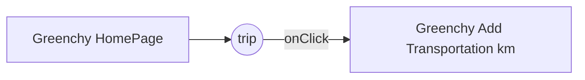

# Welcome to Greenchy!

Hi! **Greenchy** is your first sustainable trip planner. If you want to learn about Greenchy, keep reading. **Greenchy** is an online app that calculates how much CO2 you spend on a trip. From distance to meals, you can plan your perfect sustainable trip.

## What have we done

For the time being we have developed our first MVP in which you can start calculating how much CO2 your spend in distance. Simply introducing the amount of kilometers, you will have different options such as plane, train or bus to choose which one is best suitable for you order by less pollutant.
After seen the different options, you just have to press in the plus button to add that option to your trip.

## What we still plan to do

We plan to keep adding features in terms of less pollution accommodations and meals options. At the end you will have a view of your CO2 spend in your whole trip. You will have a record of each trip and stimate your annual CO2 spending.

## Project file structure

**Greenchy code** is split in two main folders: **src** and **public**. Inside src we have the MVP architecture splitting the project in: 

- Model: Layer for storing data. It is responsible for handling the domain logic(real-world business rules) and communication with the database and network layers.

|                |Description                                                   
|----------------|-------------------------------
|emissionsSource|`'Isn't this fun?'`            
|firebaseAuthModel|`"Isn't this fun?"`         
|main          |`-- is en-dash, --- is em-dash`
|resolvePromise|`'Isn't this fun?'`            
|router|`"Isn't this fun?"`         
|tripModel          |`-- is en-dash, --- is em-dash`
|userModel|`'Isn't this fun?'`            
|utils|`"Isn't this fun?"`  
        

- Views: UI(User Interface) layer. It provides the visualization of the data and keep a track of the user’s action in order to notify the Presenter.

|                |Description                                                   
|----------------|-------------------------------
|authenticationView|`'Isn't this fun?'`            
|co2VisualizationView|`"Isn't this fun?"`         
|navBarView          |`-- is en-dash, --- is em-dash`
|promiseNoData|`'Isn't this fun?'`            
|searchTransportationView|`"Isn't this fun?"`         
|tripView          |`-- is en-dash, --- is em-dash`
|welcomePageView|`'Isn't this fun?'`            

- Presenters: Fetch the data from the model and applies the UI logic to decide what to display. It manages the state of the View and takes actions according to the user’s input notification from the View. 

|                |Description                                                   
|----------------|-------------------------------
|addTransportationPresenter|`'Isn't this fun?'`            
|authenticationPresenter|`"Isn't this fun?"`         
|navBarPresenter          |`-- is en-dash, --- is em-dash`
|welcomePagePresenter|`'Isn't this fun?'` 

## UML diagrams

